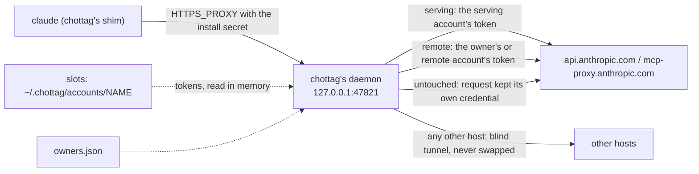

# How c-hottag works

## The four words

- **Home**: `~/.claude` and `~/.claude.json`, your normal Claude Code login.
  chottag never writes to it.
- **account**: a login chottag keeps in its own slot,
  `~/.chottag/accounts/<name>`, added with `chottag login <name>`.
- **serving**: the account that pays for inference right now — the name
  after `serving:` on `chottag status`'s first line (`serving: X   remote:
  Y`). `chottag tag` and `chottag next` change it.
- **remote**: the account that owns new claude.ai objects — the name after
  `remote:` on that same line: remote-control sessions, artifacts,
  connectors. Objects that already exist stay with the account that
  created them. Routines are the exception: they always follow whichever
  account is remote, even an existing routine.

## Slots

Each account chottag knows about is a full Claude Code config dir, a
*slot*: `~/.chottag/accounts/<name>` (or under `$CHOTTAG_HOME`, if you set
it). `chottag login <name>` creates the slot and runs `claude auth login`
with `CLAUDE_CONFIG_DIR` pointing at it, so Claude Code itself does the
login and writes its own credentials there. chottag never copies a token
out of a slot; it only reads one, in memory, to swap it into a request.

## The shim

`bin/claude` is chottag under another name. When a session runs `claude`,
the shim:

1. makes sure the daemon is running, starting it if it is not;
2. checks the daemon proves it holds this install's own secret (a fresh
   health challenge, not just "something answered on the port");
3. runs the real `claude` binary with
   `HTTPS_PROXY=http://chottag.<pool>.<sid>:<password>@127.0.0.1:47821`, a
   credential made for this session alone (`<pool>` is `default`, or the
   pool `CHOTTAG_POOL` names; `<sid>` is a new random id; the
   password is derived from the install's secret and that user, so the
   secret itself is not handed out; the older `chottag:<secret>` form still
   works, as an unidentified caller),
   and `NODE_EXTRA_CA_CERTS` set to chottag's CA certificate — or, if the
   shell already had its own `NODE_EXTRA_CA_CERTS`, a bundle of that file
   plus chottag's CA, so neither trust store is lost.

`CHOTTAG_BYPASS=1 claude` skips all of that and execs the real binary
directly, with whatever `HTTPS_PROXY`/`NODE_EXTRA_CA_CERTS` this shell
already had.

`claude auth ...` (`auth login`, `auth status` and the rest) and `claude
setup-token` skip chottag on their own, with no `CHOTTAG_BYPASS=1`: the shim
sees the subcommand (`auth` or `setup-token` as the first argument, matched exactly),
execs the real binary without reading `state.json`, starting the daemon or
registering a session, and drops chottag's own `HTTPS_PROXY`, so a login talks to Anthropic directly and Home records
the right account. A proxy of your own is kept, and `NODE_EXTRA_CA_CERTS` is left as it is. A prompt that
merely contains the word (`claude "auth flow"`, `claude -p auth`) is not
affected, and neither is one with a flag first (`claude --debug auth login`
still goes through chottag). The shim cannot see a slash command: for `/login` inside a session,
start that session with `CHOTTAG_BYPASS=1 claude`.

## The proxy

The chottag daemon listens on `127.0.0.1` only — nothing off the local
machine can reach it. For a `CONNECT` to `api.anthropic.com` or
`mcp-proxy.anthropic.com`, it terminates TLS with a leaf certificate from
its own local CA, reads the request, and swaps in the token of whichever
account the router picks. A `CONNECT` to any other host is a blind
tunnel: chottag never terminates its TLS and never swaps anything on it.
An absolute-form request (one sent straight over the proxy connection,
`https://…`, rather than through a `CONNECT` tunnel) is parsed enough to
log its host and path whatever host it names, but is only ever swapped
for the two intercepted hosts above — to any other host it is forwarded
untouched. It never logs a token or a request/response body.

Claude Code treats a 401, 403 or 404 as final, so a request swapped onto an
account that is then refused is never passed back as is: the daemon refreshes
that account's token and tries once more (if the account's refresh is already
running, or finished within the last 30 seconds, the retry waits for it and
uses its new token), and if that is
refused too, it sends the request once on Claude Code's own login (never, with
more than one pool, or for a remote or owner request). For a request about a
claude.ai object, to a route the table does not list, or answered 404 (other than on `POST /v1/messages`, below), this
counts as route drift (`chottag doctor`'s `route-drift` row and its notice).
A 404 on `POST /v1/messages` is the exception, since 0.9.3: Claude Code's Message
Threads continue a thread only the account that created it holds, and Claude Code
sends the turn again as a create when it gets a 404, so the daemon returns that
404 unchanged (no refresh, retry, Home resend, drift count or notice) and marks
the `proxy.jsonl` record `passed404`.
An object whose owner chottag does not know, routed to the remote account, is
another exception: a `GET` or `HEAD` it refuses with a 403 or 404 skips the
refresh and is tried on the pool's other accounts, and no refusal of it is
route drift (see [The owner map](#the-owner-map)). Connector calls and serving
routes such as `/v1/sessions/{id}` keep the refresh and the checks above.
For a 401 or 403 on `/v1/messages` or `POST /api/oauth/validate` it is the account's login being refused
instead: the daemon log gets a line, the
notice names the account and the status (at most once an hour per account),
and `proxy.jsonl`'s `refused` field holds the first refused status beside
`drift`.

## Which account a request uses

The router gives every intercepted request one of three classes:

- `serving` — inference, and anything that reports your own usage: routed
  to the serving account.
- `remote` — creating or operating on a claude.ai-owned object
  (remote-control session, `claude remote-control` environment, artifact,
  connector): routed to the remote account, or to the object's owner if
  the owner map already knows one.
- `untouched` — a request that must keep its own credential, or stay on
  Home's login, and is left alone.

One serving request is sticky per session. A Claude Code session's own
`POST /api/oauth/validate` (through the intercepted tunnel, not the
`claude remote-control` server's, which is remote) is where Remote Control
checks which account it is signed in as, and it stops when the answer is a
different account from the one it pinned at start. So the first account that
answers a session's validate keeps answering it for that session's life, even
after the serving account moves, and chottag remembers it in
`run/validate-sessions.json` under `CHOTTAG_HOME` (session id, account name,
its email and last use, plus a bounded list of recently dropped entries,
never a token; at most 500 sessions, none kept after 7 days unused), so a daemon restart keeps it. A recorded account whose
token has gone stale is refreshed first (the same wait of up to 15 seconds as a
remote request), and the warm loop keeps the accounts of sessions used in the
last day fresh even when no pool serves them any more. Only when that account
is no longer registered, was logged in again as another email, is not in the
session's pool, has rotation off (outside the default pool), needs login, or
cannot be refreshed does the request go out as the serving account instead,
and `daemon.log` says `validate for session 1a2b3c4d moved from C to D: C needs
login` (or `is no longer registered`, `was logged in again as another
account`, `is not in pool P`, `has rotation off`, `could not refresh its
login`). A session whose record was dropped (7 days unused, or pushed out by
newer sessions) is pinned again to the serving account, with a line saying so.
A session without an id keeps the plain serving rule.

## The owner map

The first account to create a remote-control session, environment,
artifact or connector owns it. chottag records that in `owners.json`, and
every later request about that object goes to its owner, not to whichever
account happens to be `remote` at the time.
`chottag own <kind> <id> [<account>]` shows or moves an object's owner.

When chottag does not know an object's owner (an artifact made on claude.ai,
say), a `GET` or `HEAD` for it goes to the `remote` account first. If that
account is refused with a 403 or 404, chottag tries the other accounts of the
session's pool once, up to 8, and sends back the first answer that is not a
refusal. It records that account as the owner, only when its answer succeeds
(a 429 or a 5xx is sent back but not recorded), so later requests go straight
there. If no account can open the object, the client gets the first refusal,
chottag does not try again for an hour, and you get one
`chottag: an artifact's owner is unknown` notice per account per hour. That is
not route drift.

## Usage and auto-switch

The daemon reads each account's 5h and 7d usage out of the API's own
response headers as it forwards them; for an account that has sent no
traffic (idle, or already limited and waiting on a reset), it falls back
to its own poll of `/api/oauth/usage`: at daemon start, when a limit is due
to reset, and on an idle schedule, about 30 minutes after the account's last
usage update (2 hours for a rotation-off account such as the remote), spread
by a tenth either way and 2 seconds apart. A poll that fails with a 429 waits
the server's `Retry-After`, else 60 and then 120 minutes. A poll that finds
the account has no usable login records `needs-login` (one notice) and stops
polling it until it logs in again. Either way, the result
lands in a derived view in `cache/status.json` — the file
`chottag status` reads. Auto-switch acts on that same view, moving
`serving` before an account runs out ([auto-switch](auto-switch.md)). It
tells three ages of reading apart: fresh (under 10 minutes), the only age
that can make the serving account leave; recent (under 45 minutes), trusted
to choose a target; and old, ranked after the recent ones.

The daemon keeps every rotating account's token warm, not only the serving
and remote ones, so that an account auto-switch picks has a usable login. The same pass records `needs-login` (one notice) for an account whose login it finds gone.

## Spreading sessions (spread)

By default (`chottag policy serial`) every session goes out as the one
serving account. `chottag policy spread` instead places each session on its
own account, so several sessions at once share the load of several accounts.

- **Placement.** A session is placed on its first inference request: of the
  accounts that can take it, the one with the highest headroom ÷ (1 + the
  sessions already on it). Headroom is the distance to the account's switch
  point in the tighter of its 5h and 7d windows, times the plan size. An
  account with no usage reading yet counts as fresh. Ties go to the earlier
  registered account. The account `chottag tag NAME` pinned wins outright
  while it can take a session. The pin is for new sessions only: it is never
  used to move one.
- **Sticky.** A session stays on its account, so its prompt cache stays
  warm. It moves only on three triggers: its account reaches a switch point
  (`chottag auto set`), its account is limited, or its prompt cache is
  already cold (the conversation changed) and another account is clearly
  better (1.5 times the score). A request that hits a limit is retried once
  on a new account, as with auto-switch.
- **No flapping.** A move for a switch point or a cold cache happens at most
  once in 10 minutes per session, and never straight back to the account the
  session just left. If no other account can take it, the session stays where
  it is. A move off an account that cannot serve anyone at all (it is limited,
  has rotation off, or needs a login), and the retry after a limit hit,
  ignore the 10 minutes. If such a session has nowhere to go, its placement is
  dropped and the request goes out on the fallback account (below), and it is
  placed again at its next request.
- **Restarts keep placements.** They are saved in `run/placements.json`
  within a few seconds of a change and at shutdown, so restarting the daemon
  (or updating chottag) leaves every session where it was. The record of a
  session that has ended goes away after a while. Only sessions that are
  alive count as load on an account.
- **Turning spread on.** A session already running keeps the account it is
  using, when that account can take it, so its prompt cache stays warm;
  moves for balance then happen only by the rules above. Sessions started
  after that are placed by score.
- **After an update, restart the daemon first.** A daemon from before 0.7.0
  does not know the policy and, the next time it writes `state.json`, drops
  it. After `chottag update` run `chottag daemon restart` (or wait until the
  daemon restarts itself when idle) before `chottag policy spread`;
  `chottag policy spread` warns (`daemon_predates_spread`) when it finds an
  older daemon.
- **Rolling back.** Installing a release older than 0.7.0 (`chottag update
  --version v0.6.x`) returns to serial behaviour: the older chottag ignores
  the policy, the pin and the placements and may delete `run/placements.json`.
  Run `chottag policy spread` again after upgrading back.
- **Rotation off means no sessions.** An account with rotation off (by
  default the `remote` account of an owner who keeps one) is never given a
  session, and a session on an account that is switched to rotation off moves
  at once.
- **Auto-switch off does not stop it.** Spread moves sessions at switch
  points and limits whether or not auto-switch is on; `chottag policy
  serial` is what stops it.
- **Notices.** When an account reaches a switch point or is limited and has
  sessions, one desktop notice says `chottag: moved 3 sessions from A to B, C`
  (the body says why: `A reached its 5-hour switch point.`, `A hit its 5-hour
  limit.`), or `chottag: 3 sessions on A have no account to move to` when
  nothing else can take them. A request that hits a limit and is retried on
  another account also posts the usual "switched" notice, once per limited
  account. `chottag notify` turns them on and off.
- **Unidentified sessions.** A `claude` started by a shim from before 0.6.0
  has no session id, so it cannot be placed and uses the serving account.
  Requests for claude.ai objects still follow the owner map and `remote`, as
  always.
- **What `serving` means.** Under spread `serving` is no longer "the account
  every session uses". It is the account for unidentified sessions and the
  fallback when no account can take a session. That fallback is `serving` if
  it has rotation on; otherwise the rotating account that is least bad (one
  that is neither limited nor needing a login first, then a limited one
  before one needing a login, then the lowest usage);
  only when no account rotates is it `serving` anyway. A rotation-off account
  is never the fallback while a rotating one exists. `chottag next` is refused, and
  `chottag status` shows the policy, the pin and, per account, how many
  sessions it carries.



## Pools

A **pool** is a named set of accounts with its own serving account, remote
account, policy (`serial` or `spread`) and pin. Everything above (serving,
remote, the owner map, spread) is the `default` pool's, which always exists;
you add more when you want to keep accounts apart, such as work and personal:

```sh
chottag pool add work
chottag login C --pool work      # a new account, in work only
chottag pool join B work         # an existing account, now also in work
CHOTTAG_POOL=work claude         # a session in the work pool
```

- **A session picks its pool at launch** with `CHOTTAG_POOL=NAME claude`;
  unset means `default`. The choice is part of the session's proxy
  credential, so it cannot be changed from inside. A name that is not a pool
  stops the launch (`chottag: no pool named "x" (chottag pool lists them)`,
  exit 2): it never falls back to `default`.
- **Aliases keep the choice.** Add them to your shell's rc file yourself,
  for example `alias cwork='CHOTTAG_POOL=work claude'` and
  `alias cpersonal='CHOTTAG_POOL=personal claude'`; chottag never edits your rc file
  for this. Pick names that are not existing commands (an alias called `cp`
  would shadow the copy command).
- **A session is only ever served by accounts in its pool.** Inference goes to
  the pool's serving account, or, under `spread`, is placed among the pool's
  members; a new claude.ai object is created as the pool's remote account.
  Auto-switch runs for each `serial` pool on its own and stays within the pool.
  The one request that crosses a pool is a lookup of an object that already
  exists: it goes out as its owner, whatever the session's pool.
- **An account can be in several pools** (`chottag pool join ACCOUNT POOL`):
  the same login serves both, with one usage record. Rotation off applies in
  every pool (in `default`, an explicit `chottag tag` still overrides it, as before).
- **Sharing an account has a down-side, because its usage limit is one.**
  Under `spread`, the sessions of both pools compete for it, so heavy use in
  one pool moves the other's sessions off it, and their prompt caches go cold.
  Under `serial`, if the account serves both pools they use up its 5-hour
  window together and switch away from it at the same time. `pool join`
  warns (`shared_account`) when it shares an account, and `policy spread`
  warns again for a pool that has one. Keep the pools' accounts apart when
  you need them to be independent.
- **Status shows it.** `chottag status` adds a `POOLS` column and a line per
  pool once there is more than one; the status line shows `[work]` after the
  account for a session outside `default`; notices name the pool.
- **Older daemons.** A daemon from before 0.8.0 cannot read what pools write
  to `state.json`, and cannot restart itself onto 0.8.0 once pools exist.
  `chottag pool add` refuses and `pool join` warns (`daemon_predates_pools`):
  run `chottag daemon restart` first. Once a pool exists, the shim also
  refuses every session against such a daemon. See
  [Updating](updating.md) for rolling back.

## If a pool can't serve a request

Once you have more than one pool, a session only ever uses accounts from
its own pool. If none of them can serve a request (the pool has no serving
account, every member is out of rotation, or the serving account needs a
login), chottag does not fall back to the login Claude Code started with: that
account could belong to another pool, and sending a work prompt on it would
cross the line you drew. Instead chottag answers the request itself with a 503
error that names the pool, and Claude Code retries it with a delay, so a
change you make in the meantime takes effect on its own. The same holds for
the safety net: with more than one pool, a refused request is not resent on
Claude Code's own login. An existing object whose owner cannot serve (it needs a
login) gets the 503 too, rather than going out on Home's login.

**Remote and owner requests never fall back to Home, with any number of
pools, when a remote account is set.** A request about a claude.ai object
(Remote Control, a connector, an artifact, a routine) goes out as the remote
account, or as the object's owner. If that account has no usable token,
chottag first waits up to 15 seconds for a refresh (and, if the account is
backing off from a failed one, tries one more, at most once a minute per
account), then answers the request itself with a 503 (`chottag: account A
(remote) has no usable login right now; run: chottag login A`). An ordinary
HTTP request is retried by Claude Code after a 503; a long poll or a client
with a shorter timeout may give up first. The same holds when `state.json`
cannot be read. The safety net never resends such a request on Claude Code's
own login either. Before 0.8.5 it did, so an object could act as the wrong
account; the cost is in [Known limitations](known-limitations.md). The
daemon also keeps each pool's remote and serving account's token fresh
(since 0.8.6 the serving one too, so fewer prompts go out on Home's login
after an expiry or a wake: the pass starts about 10 seconds after a wake, and
a prompt sent before the refresh ends still goes out on Home's login; other
rotating members and pinned accounts are not warmed): it refreshes a token
when 6 minutes or less are left (Claude Code renews its token only inside the
last 5), and skips an account that needs a login (logged once). Every refresh
outcome is logged, one line each (`refresh C: renewed, expires in 7h59m
(request, 5.2s)`; the same line at most every 10 minutes). A refresh that
exits 0 at least three times in a row over at least 10 minutes without
renewing the token makes the account `needs-login` (`chottag login C`); the
daemon still probes it once every 15 minutes, and a renewal lifts that.
`token: stale` on `chottag status` clears when the token renews. The refresh
runs the slot's own `claude` with the auth and session variables
(`CLAUDE_CODE_OAUTH_TOKEN`, `ANTHROPIC_API_KEY`, `CLAUDECODE` and the like)
removed from its environment, so the daemon's own shell cannot override the
slot's login. A serving
request is unchanged: with only `default`, one that cannot be served still
goes out unchanged, and the daemon log says `chottag: sent on Home's own
login: A's token is stale (serving)`.

Run `chottag pool` to see each pool's members, then log in again
(`chottag login`), put an account back in rotation (`chottag rotate`), or add
a member (`chottag pool join`). With only the `default` pool nothing changes:
an unservable request still goes out on Claude Code's own login, as before.

## The Claude Code mod

The plugin also carries a mod, JavaScript that Claude Code 2.1.287 or newer
runs inside the session ([Command reference](commands.md#claude-code-mod)). It
is a view and a guard, not part of routing: the shim and the proxy still
decide every request's account, and a session without the mod, or one run
with `claude -p`, behaves the same.

What it can see: the session's own environment (it tests the proxy variable's
user name for `chottag`, and never keeps the value) and what
`chottag statusline --json`, `chottag status` and the `chottag next`, `tag`
and `pool` verbs print. What it cannot: it never reads `~/.chottag`, a slot's
files or a token, and it only asks chottag to change something when you type
`/ct next` or `/ct tag NAME`. It draws the status card above the prompt,
shows a toast when the session's account changes, an update is out or the
remote account needs a login, and stops `/login` and `/logout` in a chottag
session, because there they would change Claude Code's own (Home) login.
