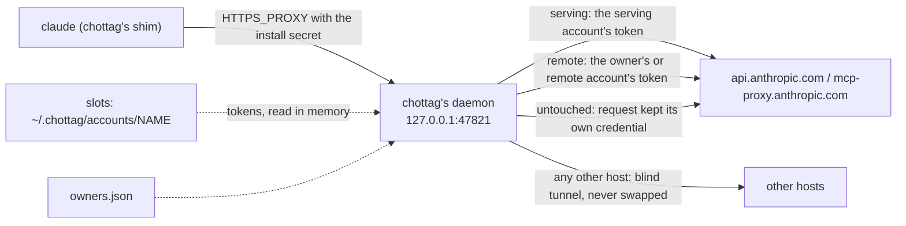

# How c-hottag works

## The four words

- **Home**: `~/.claude` and `~/.claude.json`, your normal Claude Code login.
  chottag never writes to it.
- **account**: a login chottag keeps in its own slot,
  `~/.chottag/accounts/<name>`, added with `chottag login <name>`.
- **serving**: the account that pays for inference right now — the name
  after `serving:` on `chottag status`'s first line (`serving: X   remote:
  Y`). `chottag tag` and `chottag next` change it.
- **remote**: the account that owns new claude.ai objects — the name after
  `remote:` on that same line: remote-control sessions, artifacts,
  connectors. Objects that already exist stay with the account that
  created them. Routines are the exception: they always follow whichever
  account is remote, even an existing routine.

## Slots

Each account chottag knows about is a full Claude Code config dir, a
*slot*: `~/.chottag/accounts/<name>` (or under `$CHOTTAG_HOME`, if you set
it). `chottag login <name>` creates the slot and runs `claude auth login`
with `CLAUDE_CONFIG_DIR` pointing at it, so Claude Code itself does the
login and writes its own credentials there. chottag never copies a token
out of a slot; it only reads one, in memory, to swap it into a request.

## The shim

`bin/claude` is chottag under another name. When a session runs `claude`,
the shim:

1. makes sure the daemon is running, starting it if it is not;
2. checks the daemon proves it holds this install's own secret (a fresh
   health challenge, not just "something answered on the port");
3. runs the real `claude` binary with
   `HTTPS_PROXY=http://chottag.default.<sid>:<password>@127.0.0.1:47821`, a
   credential made for this session alone (`<sid>` is a new random id; the
   password is derived from the install's secret and that user, so the
   secret itself is not handed out; the older `chottag:<secret>` form still
   works, as an unidentified caller),
   and `NODE_EXTRA_CA_CERTS` set to chottag's CA certificate — or, if the
   shell already had its own `NODE_EXTRA_CA_CERTS`, a bundle of that file
   plus chottag's CA, so neither trust store is lost.

`CHOTTAG_BYPASS=1 claude` skips all of that and execs the real binary
directly, with whatever `HTTPS_PROXY`/`NODE_EXTRA_CA_CERTS` this shell
already had.

## The proxy

The chottag daemon listens on `127.0.0.1` only — nothing off the local
machine can reach it. For a `CONNECT` to `api.anthropic.com` or
`mcp-proxy.anthropic.com`, it terminates TLS with a leaf certificate from
its own local CA, reads the request, and swaps in the token of whichever
account the router picks. A `CONNECT` to any other host is a blind
tunnel: chottag never terminates its TLS and never swaps anything on it.
An absolute-form request (one sent straight over the proxy connection,
`https://…`, rather than through a `CONNECT` tunnel) is parsed enough to
log its host and path whatever host it names, but is only ever swapped
for the two intercepted hosts above — to any other host it is forwarded
untouched. It never logs a token or a request/response body.

## Which account a request uses

The router gives every intercepted request one of three classes:

- `serving` — inference, and anything that reports your own usage: routed
  to the serving account.
- `remote` — creating or operating on a claude.ai-owned object
  (remote-control session, `claude remote-control` environment, artifact,
  connector): routed to the remote account, or to the object's owner if
  the owner map already knows one.
- `untouched` — a request that must keep its own credential, or stay on
  Home's login, and is left alone.

## The owner map

The first account to create a remote-control session, environment,
artifact or connector owns it. chottag records that in `owners.json`, and
every later request about that object goes to its owner, not to whichever
account happens to be `remote` at the time.
`chottag own <kind> <id> [<account>]` shows or moves an object's owner.

## Usage and auto-switch

The daemon reads each account's 5h and 7d usage out of the API's own
response headers as it forwards them; for an account that has sent no
traffic (idle, or already limited and waiting on a reset), it falls back
to its own occasional poll of `/api/oauth/usage`. Either way, the result
lands in a derived view in `cache/status.json` — the file
`chottag status` reads. Auto-switch acts on that same view, moving
`serving` before an account runs out ([auto-switch](auto-switch.md)).

