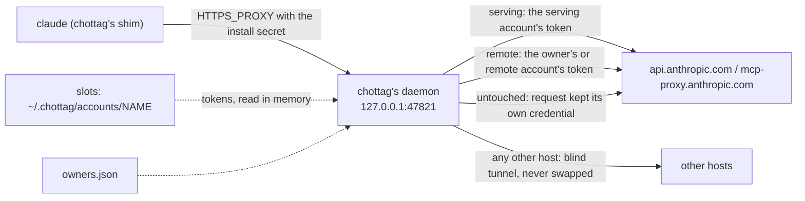

# How c-hottag works

## The four words

- **Home**: `~/.claude` and `~/.claude.json`, your normal Claude Code login.
  chottag never writes to it.
- **account**: a login chottag keeps in its own slot,
  `~/.chottag/accounts/<name>`, added with `chottag login <name>`.
- **serving**: the account that pays for inference right now — the name
  after `serving:` on `chottag status`'s first line (`serving: X   remote:
  Y`). `chottag tag` and `chottag next` change it.
- **remote**: the account that owns new claude.ai objects — the name after
  `remote:` on that same line: remote-control sessions, artifacts,
  connectors. Objects that already exist stay with the account that
  created them. Routines are the exception: they always follow whichever
  account is remote, even an existing routine.

## Slots

Each account chottag knows about is a full Claude Code config dir, a
*slot*: `~/.chottag/accounts/<name>` (or under `$CHOTTAG_HOME`, if you set
it). `chottag login <name>` creates the slot and runs `claude auth login`
with `CLAUDE_CONFIG_DIR` pointing at it, so Claude Code itself does the
login and writes its own credentials there. chottag never copies a token
out of a slot; it only reads one, in memory, to swap it into a request.

## The shim

`bin/claude` is chottag under another name. When a session runs `claude`,
the shim:

1. makes sure the daemon is running, starting it if it is not;
2. checks the daemon proves it holds this install's own secret (a fresh
   health challenge, not just "something answered on the port");
3. runs the real `claude` binary with
   `HTTPS_PROXY=http://chottag.default.<sid>:<password>@127.0.0.1:47821`, a
   credential made for this session alone (`<sid>` is a new random id; the
   password is derived from the install's secret and that user, so the
   secret itself is not handed out; the older `chottag:<secret>` form still
   works, as an unidentified caller),
   and `NODE_EXTRA_CA_CERTS` set to chottag's CA certificate — or, if the
   shell already had its own `NODE_EXTRA_CA_CERTS`, a bundle of that file
   plus chottag's CA, so neither trust store is lost.

`CHOTTAG_BYPASS=1 claude` skips all of that and execs the real binary
directly, with whatever `HTTPS_PROXY`/`NODE_EXTRA_CA_CERTS` this shell
already had.

## The proxy

The chottag daemon listens on `127.0.0.1` only — nothing off the local
machine can reach it. For a `CONNECT` to `api.anthropic.com` or
`mcp-proxy.anthropic.com`, it terminates TLS with a leaf certificate from
its own local CA, reads the request, and swaps in the token of whichever
account the router picks. A `CONNECT` to any other host is a blind
tunnel: chottag never terminates its TLS and never swaps anything on it.
An absolute-form request (one sent straight over the proxy connection,
`https://…`, rather than through a `CONNECT` tunnel) is parsed enough to
log its host and path whatever host it names, but is only ever swapped
for the two intercepted hosts above — to any other host it is forwarded
untouched. It never logs a token or a request/response body.

## Which account a request uses

The router gives every intercepted request one of three classes:

- `serving` — inference, and anything that reports your own usage: routed
  to the serving account.
- `remote` — creating or operating on a claude.ai-owned object
  (remote-control session, `claude remote-control` environment, artifact,
  connector): routed to the remote account, or to the object's owner if
  the owner map already knows one.
- `untouched` — a request that must keep its own credential, or stay on
  Home's login, and is left alone.

## The owner map

The first account to create a remote-control session, environment,
artifact or connector owns it. chottag records that in `owners.json`, and
every later request about that object goes to its owner, not to whichever
account happens to be `remote` at the time.
`chottag own <kind> <id> [<account>]` shows or moves an object's owner.

## Usage and auto-switch

The daemon reads each account's 5h and 7d usage out of the API's own
response headers as it forwards them; for an account that has sent no
traffic (idle, or already limited and waiting on a reset), it falls back
to its own occasional poll of `/api/oauth/usage`. Either way, the result
lands in a derived view in `cache/status.json` — the file
`chottag status` reads. Auto-switch acts on that same view, moving
`serving` before an account runs out ([auto-switch](auto-switch.md)).

## Spreading sessions (spread)

By default (`chottag policy serial`) every session goes out as the one
serving account. `chottag policy spread` instead places each session on its
own account, so several sessions at once share the load of several accounts.

- **Placement.** A session is placed on its first inference request: of the
  accounts that can take it, the one with the highest headroom ÷ (1 + the
  sessions already on it). Headroom is the distance to the account's switch
  point in the tighter of its 5h and 7d windows, times the plan size. An
  account with no usage reading yet counts as fresh. Ties go to the earlier
  registered account. The account `chottag tag NAME` pinned wins outright
  while it can take a session. The pin is for new sessions only: it is never
  used to move one.
- **Sticky.** A session stays on its account, so its prompt cache stays
  warm. It moves only on three triggers: its account reaches a switch point
  (`chottag auto set`), its account is limited, or its prompt cache is
  already cold (the conversation changed) and another account is clearly
  better (1.5 times the score). A request that hits a limit is retried once
  on a new account, as with auto-switch.
- **No flapping.** A move for a switch point or a cold cache happens at most
  once in 10 minutes per session, and never straight back to the account the
  session just left. If no other account can take it, the session stays where
  it is. A move off an account that cannot serve anyone at all (it is limited,
  has rotation off, or needs a login), and the retry after a limit hit,
  ignore the 10 minutes. If such a session has nowhere to go, its placement is
  dropped and the request goes out on the fallback account (below), and it is
  placed again at its next request.
- **Restarts keep placements.** They are saved in `run/placements.json`
  within a few seconds of a change and at shutdown, so restarting the daemon
  (or updating chottag) leaves every session where it was. The record of a
  session that has ended goes away after a while. Only sessions that are
  alive count as load on an account.
- **Turning spread on.** A session already running keeps the account it is
  using, when that account can take it, so its prompt cache stays warm;
  moves for balance then happen only by the rules above. Sessions started
  after that are placed by score.
- **After an update, restart the daemon first.** A daemon from before 0.7.0
  does not know the policy and, the next time it writes `state.json`, drops
  it. After `chottag update` run `chottag daemon restart` (or wait until the
  daemon restarts itself when idle) before `chottag policy spread`;
  `chottag policy spread` warns (`daemon_predates_spread`) when it finds an
  older daemon.
- **Rolling back.** Installing a release older than 0.7.0 (`chottag update
  --version v0.6.x`) returns to serial behaviour: the older chottag ignores
  the policy, the pin and the placements and may delete `run/placements.json`.
  Run `chottag policy spread` again after upgrading back.
- **Rotation off means no sessions.** An account with rotation off (by
  default the `remote` account of an owner who keeps one) is never given a
  session, and a session on an account that is switched to rotation off moves
  at once.
- **Auto-switch off does not stop it.** Spread moves sessions at switch
  points and limits whether or not auto-switch is on; `chottag policy
  serial` is what stops it.
- **Notices.** When an account reaches a switch point or is limited and has
  sessions, one desktop notice says `chottag: moved 3 sessions from A to B, C`
  (the body says why: `A reached its 5-hour switch point.`, `A hit its 5-hour
  limit.`), or `chottag: 3 sessions on A have no account to move to` when
  nothing else can take them. A request that hits a limit and is retried on
  another account also posts the usual "switched" notice, once per limited
  account. `chottag notify` turns them on and off.
- **Unidentified sessions.** A `claude` started by a shim from before 0.6.0
  has no session id, so it cannot be placed and uses the serving account.
  Requests for claude.ai objects still follow the owner map and `remote`, as
  always.
- **What `serving` means.** Under spread `serving` is no longer "the account
  every session uses". It is the account for unidentified sessions and the
  fallback when no account can take a session. That fallback is `serving` if
  it has rotation on; otherwise the rotating account that is least bad (one
  that is neither limited nor needing a login first, then a limited one
  before one needing a login, then the lowest usage);
  only when no account rotates is it `serving` anyway. A rotation-off account
  is never the fallback while a rotating one exists. `chottag next` is refused, and
  `chottag status` shows the policy, the pin and, per account, how many
  sessions it carries.

